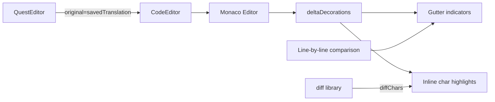

# Plan: VS Code-style Diff в редакторе перевода

## Цель

Улучшить отображение diff в правой панели редактора квеста (перевод) — сделать его похожим на то, как VS Code показывает изменения в файлах относительно git:
- **Gutter-индикаторы**: цветные полоски слева от строк (зелёные для добавленных/изменённых, красные для удалённых)
- **Inline diff**: подсветка добавленных/удалённых символов внутри изменённых строк

---

## Текущее состояние

Сейчас в [`CodeEditor.tsx`](src/components/CodeEditor.tsx) (строки 128-144) diff реализован примитивно:
- Сравниваются строки оригинала и текущего значения **побочно** (line-by-line)
- Если строка отличается — вся строка подсвечивается зелёным фоном через `className: 'diff-line-added'`
- Нет gutter-индикаторов
- Нет inline diff (по символам)
- Нет индикации удалённых строк

В [`QuestEditor.tsx`](src/components/QuestEditor.tsx) (строка 256) в `CodeEditor` передаётся `original={savedTranslation}`, что позволяет видеть diff относительно последнего сохранения.

---

## План реализации

### Шаг 1: Использовать Monaco Editor API для gutter-индикаторов

Monaco Editor поддерживает `deltaDecorations` с опциями `linesDecorationsClassName` для gutter-индикаторов.

**Типы gutter-индикаторов:**
- `diff-gutter-inserted` (зелёная полоска) — строка добавлена или изменена
- `diff-gutter-deleted` (красная полоска) — строка удалена (в оригинале есть, в текущем — нет)
- `diff-gutter-modified` (жёлтая/оранжевая полоска) — строка изменена

**Логика определения типа строки:**
```
Для каждой строки i (0-based):
  origLine = originalLines[i] или undefined
  curLine  = currentLines[i]   или undefined

  if origLine === undefined && curLine !== undefined:
    → inserted (строка добавлена)
  elif origLine !== undefined && curLine === undefined:
    → deleted (строка удалена)
  elif origLine !== curLine:
    → modified (строка изменена)
  else:
    → unchanged
```

### Шаг 2: Использовать Monaco Editor API для inline diff

Monaco Editor поддерживает `inlineClassName` в `deltaDecorations` для подсветки отдельных диапазонов символов.

Для inline diff используем библиотеку `diff` (уже есть в зависимостях — `diff: ^9.0.0`):
- `diffChars(originalLine, currentLine)` — сравнение по символам
- Для каждого `part`:
  - `part.added && !part.removed` → зелёный фон (`diff-char-inserted`)
  - `part.removed && !part.added` → красный фон (`diff-char-deleted`)
  - `part.removed && part.added` → изменённый (`diff-char-modified`)

**Важно:** В Monaco Editor мы не можем показать удалённые символы в текущем тексте (их там нет). Вместо этого:
- Для **modified** строк: показываем добавленные символы зелёным, а удалённые — не показываем (они видны только в оригинале)
- Альтернатива: использовать `renderWhitespace` и показывать diff через `overviewRuler`

**Лучший подход для inline diff:**
- Для каждой **modified** строки вычисляем `diffChars(origLine, curLine)`
- Создаём декорации для `added` частей (зелёный фон)
- Удалённые части не декорируем (их нет в текущем тексте), но они учтены в gutter

### Шаг 3: Обновить CSS-стили

В [`src/styles/tokens.css`](src/styles/tokens.css) добавить:

```css
/* Gutter-индикаторы */
.diff-gutter-inserted {
  border-left: 3px solid #2ecc71;
  background: rgba(46, 204, 113, 0.1);
}
.diff-gutter-deleted {
  border-left: 3px solid #e74c3c;
  background: rgba(231, 76, 60, 0.1);
}
.diff-gutter-modified {
  border-left: 3px solid #f39c12;
  background: rgba(243, 156, 18, 0.1);
}

/* Inline diff */
.diff-char-inserted {
  background: rgba(46, 204, 113, 0.35);
  border-bottom: 2px solid #2ecc71;
}
.diff-char-deleted {
  background: rgba(231, 76, 60, 0.35);
  border-bottom: 2px solid #e74c3c;
}
```

### Шаг 4: Модифицировать CodeEditor.tsx

Заменить текущую логику diff (строки 127-144) на новую:

```typescript
// Diff decorations: gutter + inline
if (original) {
  const origLines = original.split('\n');
  const curLines = value.split('\n');
  const maxLen = Math.max(origLines.length, curLines.length);

  for (let i = 0; i < maxLen; i++) {
    const origLine = i < origLines.length ? origLines[i] : undefined;
    const curLine = i < curLines.length ? curLines[i] : '';
    const lineNum = i + 1;

    if (origLine === undefined && curLine !== '') {
      // Inserted line
      decorations.push({
        range: new monaco.Range(lineNum, 1, lineNum, 1),
        options: {
          isWholeLine: true,
          linesDecorationsClassName: 'diff-gutter-inserted',
          className: 'diff-line-inserted',
        },
      });
    } else if (origLine !== undefined && curLine === '') {
      // Deleted line — gutter only (line is empty in current)
      decorations.push({
        range: new monaco.Range(lineNum, 1, lineNum, 1),
        options: {
          isWholeLine: true,
          linesDecorationsClassName: 'diff-gutter-deleted',
          className: 'diff-line-deleted',
        },
      });
    } else if (origLine !== undefined && curLine !== origLine) {
      // Modified line: gutter + inline diff
      const inlineDecorations = computeInlineDiff(origLine, curLine, lineNum, monaco);
      decorations.push(...inlineDecorations);
      
      // Gutter indicator
      decorations.push({
        range: new monaco.Range(lineNum, 1, lineNum, 1),
        options: {
          isWholeLine: true,
          linesDecorationsClassName: 'diff-gutter-modified',
          className: 'diff-line-modified',
        },
      });
    }
  }
}
```

Функция `computeInlineDiff`:

```typescript
function computeInlineDiff(origLine: string, curLine: string, lineNum: number, monaco: any): any[] {
  const decorations: any[] = [];
  const diffs = diffChars(origLine, curLine);
  let col = 1;
  
  for (const part of diffs) {
    if (part.added && !part.removed) {
      // Inserted characters
      const endCol = col + part.value.length;
      decorations.push({
        range: new monaco.Range(lineNum, col, lineNum, endCol),
        options: { inlineClassName: 'diff-char-inserted' },
      });
      col = endCol;
    } else if (!part.removed) {
      // Unchanged characters
      col += part.value.length;
    }
    // Removed-only parts are not shown in current text
  }
  
  return decorations;
}
```

### Шаг 5: Обновить QuestEditor.tsx (если нужно)

Проверить, что `original={savedTranslation}` корректно передаётся. Сейчас это уже сделано (строка 256). Дополнительных изменений не требуется.

---

## Файлы для изменения

| Файл | Изменения |
|------|-----------|
| [`src/components/CodeEditor.tsx`](src/components/CodeEditor.tsx) | Заменить логику diff (строки 127-144) на новую с gutter + inline |
| [`src/styles/tokens.css`](src/styles/tokens.css) | Добавить CSS-классы для gutter и inline diff |

## Файлы, которые НЕ нужно менять

| Файл | Причина |
|------|---------|
| [`src/components/QuestEditor.tsx`](src/components/QuestEditor.tsx) | Уже корректно передаёт `original={savedTranslation}` |
| [`src/lib/prism-grammar.ts`](src/lib/prism-grammar.ts) | Prism используется для read-only подсветки, не для редактора |
| [`src/lib/tokenizer.ts`](src/lib/tokenizer.ts) | Кастомный токенизатор не используется в Monaco Editor |
| [`src/components/EditableHighlighter.tsx`](src/components/EditableHighlighter.tsx) | Не используется в активных маршрутах |

---

## Поведение в разных сценариях

| Сценарий | Gutter | Inline |
|----------|--------|--------|
| Строка добавлена (есть в переводе, нет в сохранённом) | 🟢 Зелёная полоска | Вся строка зелёным фоном |
| Строка удалена (есть в сохранённом, нет в переводе) | 🔴 Красная полоска | Строка красным фоном (пустая) |
| Строка изменена (отличается от сохранённой) | 🟡 Жёлтая полоска | Добавленные символы — зелёным |
| Строка не изменена | Нет индикатора | Нет подсветки |
| Файл только загружен (нет сохранённой версии) | Нет diff | Нет подсветки |

---

## Диаграмма потока данных



## Диаграмма визуального результата

```
┌─────────────────────────────────────┐
│ Gutter │ Line numbers │ Code        │
├────────┼──────────────┼─────────────┤
│ 🟢     │     1        │ [LYRA_smile]│  ← inserted line
│        │     2        │ Hello world │  ← unchanged
│ 🟡     │     3        │ New text    │  ← modified (inline: green bg on "New")
│ 🔴     │     4        │             │  ← deleted line (empty)
│        │     5        │ Goodbye     │  ← unchanged
└────────┴──────────────┴─────────────┘